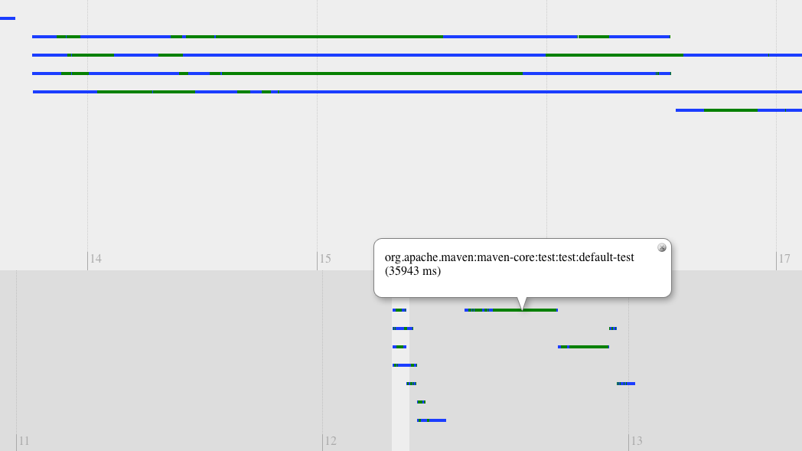

# Takari Maven Timeline

## How to generate a timeline for your project

To generate a timeline for your project add this section to your `pom.xml`:

```xml
<extensions>
  <extension>
    <groupId>io.takari.maven</groupId>
    <artifactId>maven-timeline</artifactId>
    <version>1.8</version>
  </extension>
</extensions>
```


Once your project has run you will have a `target/timeline/timeline.html` in the top-level of your project. The output will look something like the following:



## Building

Build time requirement is Java 11 and recent Maven (3.8+ recommended). It uses the new "release" flag of compiler to produce Java 7 bytecode.
Hence, runtime Java requirement is still Java 7.
