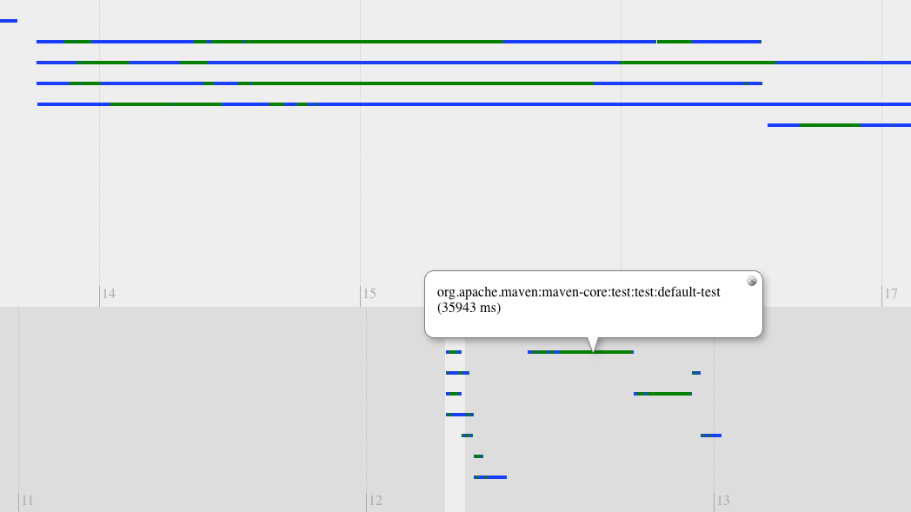

# Takari Maven Timeline

[](https://search.maven.org/artifact/io.takari.maven/maven-timeline)
[](https://github.com/takari/maven-timeline/actions/workflows/ci.yml)
[](https://github.com/jvm-repo-rebuild/reproducible-central/blob/master/content/io/takari/maven/maven-timeline/README.md)

## How to generate a timeline for your project

A tiny, minimal overhead extension to create build metrics and timeline for projects being built. 

Runtime requirement is Java 8 and Maven 3.6+.

To generate a timeline for your project add this to the `build` section of your `pom.xml`, or (recommended), create file `.mvn/extensions.xml` is project root with contents as below:

```xml
<?xml version="1.0" encoding="UTF-8"?>
<extensions>
  <extension>
    <groupId>io.takari.maven</groupId>
    <artifactId>maven-timeline</artifactId>
    <version>2.0.3</version>
  </extension>
</extensions>
```

Once your project has run you will have a `target/timeline/timeline.html` in the top-level of your project. The output will look something like the following:

## Configuration

Use following Java System Properties (not Maven User Properties!):

* `maven-timeline.enabled` to enable or disable Timeline creation and export, default is `true`
* `maven-timeline.metrics.output.file` the output of metrics JSON file, default is `target/execution-metrics.json`
* `maven-timeline.timeline.output.file` the output of Timeline (data and HTML/JS), default is `target/timeline/maven-timeline.js`



## Building

Build time requirement is Java 17+ and recent Maven (3.9+ recommended).
